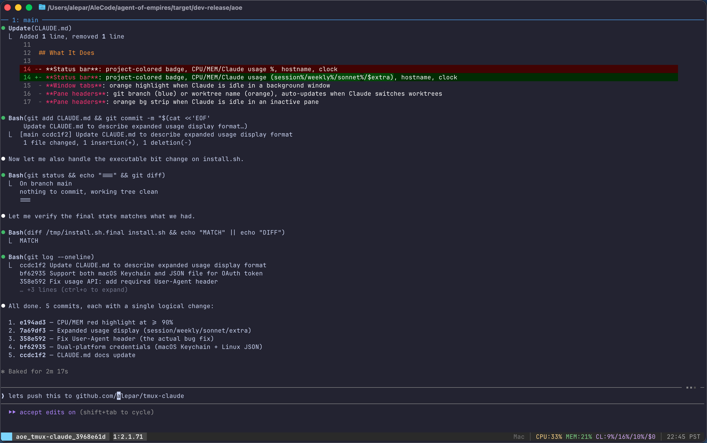

# tmux-claude

A tmux setup optimized for [Claude Code](https://docs.anthropic.com/en/docs/claude-code) workflows. Gives you at-a-glance visibility into Claude's activity across multiple panes and windows — idle notifications, git context, API usage, and system stats.

Single install script deploys everything.



## Features

**Status bar** — project-colored session badge, CPU/MEM usage, Claude API usage (session%/weekly%/sonnet%/$extra), hostname, and clock. CPU, MEM, and usage stats turn red when they hit critical thresholds.

**Idle notifications** — when Claude finishes working and is waiting for input in a background pane or window, you'll see it highlighted in orange. Focusing the pane dismisses the notification, just like reading a chat message.

**Pane headers** — each pane shows the current git branch (blue) or worktree name (orange). Automatically updates when Claude switches directories or worktrees.

**Multi-pane aware** — idle detection and git context are tracked per-pane using marker files, so multiple Claude sessions in split panes work correctly.

## Prerequisites

- `tmux` 3.5+
- `git`
- `bash`
- `curl` + `python3` (for Claude usage API)
- `jq` (for Claude Code hooks — idle detection, cwd tracking)

## Install

```bash
git clone https://github.com/alepar/tmux-claude.git
cd tmux-claude
bash install.sh
```

If you're already inside tmux:

```bash
tmux source ~/.tmux.conf
```

The installer backs up your existing `~/.tmux.conf` before overwriting.

### What gets installed

| File | Purpose |
|------|---------|
| `~/.tmux.conf` | Main tmux config |
| `~/.tmux/pane-label.sh` | Pane headers: git branch/worktree + idle indicator |
| `~/.tmux/claude-usage.sh` | Claude API usage with 60s cache |
| `~/.tmux/claude-cwd-hook.sh` | Tracks Claude's working directory |
| `~/.tmux/cleanup-markers.sh` | Cleans up stale marker files |
| `~/.tmux/project-color.sh` | Session name to deterministic color badge |
| `~/.tmux/cpu.sh` | CPU usage (macOS + Linux) |
| `~/.tmux/mem.sh` | Memory usage (macOS + Linux) |

The installer also adds hooks to `~/.claude/settings.json` (merges with existing settings, does not overwrite).

## Platform support

| | macOS | Linux |
|---|---|---|
| CPU stats | `top -l` | `/proc/stat` |
| Memory stats | `vm_stat` | `/proc/meminfo` |
| Working directory | `lsof` | `/proc/pid/cwd` |
| OAuth credentials | Keychain | `~/.claude/.credentials.json` |

## How it works

Claude Code [hooks](https://docs.anthropic.com/en/docs/claude-code/hooks) drive the idle detection and directory tracking:

| Hook | Trigger | Action |
|------|---------|--------|
| `Notification[idle_prompt]` | Claude is waiting for input | Mark pane as idle (orange highlight) |
| `UserPromptSubmit` | User sends a prompt | Clear idle state |
| `SessionStart` | New Claude session | Initialize markers |
| `SessionEnd` | Claude session ends | Clean up markers |
| `PostToolUse[Bash]` | Claude runs a shell command | Track `cd` for pane headers |

All state is communicated via temporary marker files in `$TMPDIR`, keyed by tmux pane ID. No background daemons.

## License

MIT
