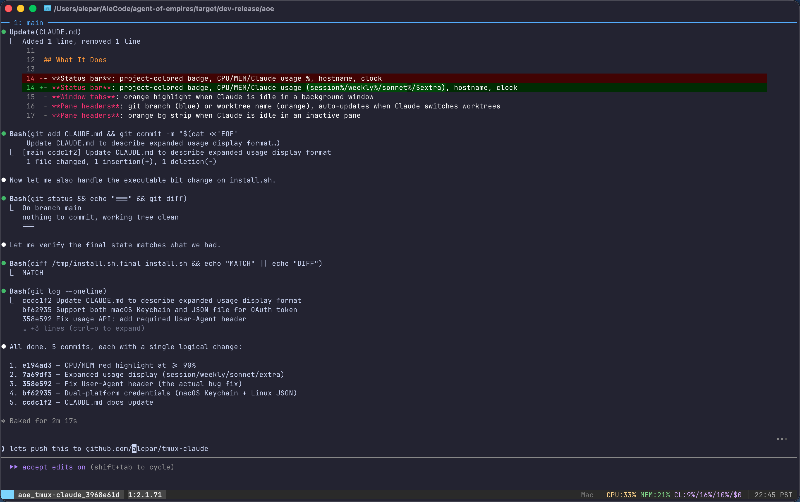

# tmux-claude

A tmux setup aware of [Claude Code](https://docs.anthropic.com/en/docs/claude-code) and Codex workflows. It provides at-a-glance agent activity, git context, usage, and system stats across multiple panes and windows.

Single install script deploys everything.



## Features

**Status bar** — project-colored session badge, CPU/MEM usage, active-agent usage, hostname, and clock. The active pane determines the agent field: `CL:` plus the existing Claude subscription usage for Claude, colored `CTX:<integer>%` when that pane has valid Codex session and context markers (regardless of its foreground command), or nothing. Codex is green below 60%, yellow through 84%, and red at 85% or above.

**Claude status line** — a 20-segment context bar that shifts green → yellow → red as the context window fills, alongside the remaining token count and current model:

```
████░░░░░░░░░░░░░░░░ | remaining: 920k/1m | Fable
```

**Idle notifications** — when Claude finishes working and is waiting for input in a background pane or window, you'll see it highlighted in orange. Focusing the pane dismisses the notification, just like reading a chat message.

**Pane headers** — each pane shows the current git branch (blue) or worktree name (orange). Automatically updates when Claude switches directories or worktrees.

**Multi-pane aware** — Claude markers and Codex context state are keyed by tmux pane ID, so multiple agent sessions in split panes cannot read one another's state.

## Prerequisites

- `tmux` 3.5+
- `git`
- `bash`
- `curl` (for Claude usage API)
- `jq` (for Claude Code hooks and the Codex context marker hook)
- Codex CLI (optional, for Codex context status)

## Install

```bash
git clone https://github.com/alepar/tmux-claude.git
cd tmux-claude
bash install.sh
```

If you're already inside tmux:

```bash
tmux source ~/.tmux.conf
```

The installer backs up your existing `~/.tmux.conf` before overwriting.

### What gets installed

| File | Purpose |
|------|---------|
| `~/.tmux.conf` | Main tmux config |
| `~/.tmux/pane-label.sh` | Pane headers: git branch/worktree + idle indicator |
| `~/.tmux/claude-usage.sh` | Claude API usage with 60s cache |
| `~/.tmux/claude-statusline.sh` | Claude Code status line: context bar + remaining tokens |
| `~/.tmux/claude-cwd-hook.sh` | Tracks Claude's working directory |
| `~/.tmux/codex-context-hook.sh` | Records and refreshes pane-keyed Codex context state |
| `~/.tmux/agent-status.sh` | Renders `CL`, `CTX`, or no agent field for the active pane |
| `~/.tmux/cleanup-markers.sh` | Cleans up stale marker files |
| `~/.tmux/project-color.sh` | Session name to deterministic color badge |
| `~/.tmux/cpu.sh` | CPU usage (macOS + Linux) |
| `~/.tmux/mem.sh` | Memory usage (macOS + Linux) |

The installer merges Claude hooks into `~/.claude/settings.json`. When the Codex CLI and `jq` are available, it registers this repository's `.claude-plugin/marketplace.json` as the local `tmux-claude` marketplace and installs its bundled `tmux-claude-context` plugin. It never writes `~/.codex/hooks.json`. Start a new Codex thread after installation so Codex loads the plugin hooks.

## Platform support

| | macOS | Linux |
|---|---|---|
| CPU stats | `top -l` | `/proc/stat` |
| Memory stats | `vm_stat` | `/proc/meminfo` |
| Working directory | `lsof` | `/proc/pid/cwd` |
| OAuth credentials | Keychain | `~/.claude/.credentials.json` |

## How it works

Claude Code [hooks](https://docs.anthropic.com/en/docs/claude-code/hooks) drive the idle detection and directory tracking:

| Hook | Trigger | Action |
|------|---------|--------|
| `Notification[idle_prompt]` | Claude is waiting for input | Mark pane as idle (orange highlight) |
| `UserPromptSubmit` | User sends a prompt | Clear idle state |
| `SessionStart` | New Claude session | Initialize markers |
| `SessionEnd` | Claude session ends | Clean up markers |
| `PostToolUse[Bash]` | Claude runs a shell command | Track `cd` for pane headers |

All state is communicated via temporary marker files in `$TMPDIR`, keyed by tmux pane ID. No background daemons.

For Codex, the bundled `tmux-claude-context` plugin provides the `SessionStart`, `Stop`, and `PostCompact` lifecycle hooks. `SessionStart` records the pane/session/transcript association; `Stop` and `PostCompact` read the latest `token_count` event from that exact transcript and atomically refresh `codex-context%NN`. Missing, malformed, mismatched, or stale state is silent; it simply produces no `CTX` field. `cleanup-markers.sh` removes Claude and Codex markers for panes that no longer exist.

## License

MIT
